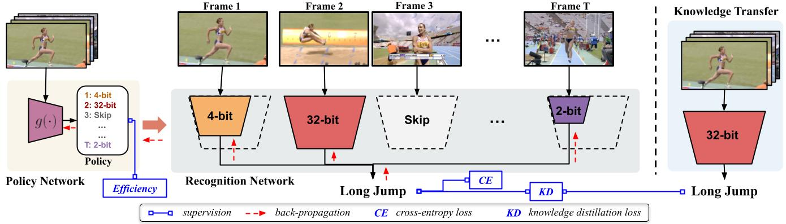

# Dynamic Network Quantization for Efficient Video Inference (ICCV2021)
## Introduction



In this paper, we propose a dynamic network quantization framework (VideoIQ), that selects optimal precision for each frame conditioned on the input for efficient
video recognition.  It consists of a very lightweight policy network and a single backbone network
for recognition which can be simply quantized to lower precisions by truncating the least significant bits. The policy network decides what
quantization precision to use on a per frame basis, in pursuit of a reduced overall computational cost without sacrificing recognition accuracy.
 We additionally distill knowledge from a pre-trained full-precision model to guide the training of lower precisions. During inference, each frame
is sequentially fed into the policy network to select optimal precision for processing the current frame through the recognition network and
then the network averages all the frame-level predictions to obtain the video-level prediction.


Here is [the link](https://arxiv.org/pdf/2108.10394.pdf) for our arxiv version. 

Welcome to cite our work if you find it is helpful to your research.
```
@InProceedings{Sun_2021_ICCV,
    author    = {Sun, Ximeng and Panda, Rameswar and Chen, Chun-Fu (Richard) and Oliva, Aude and Feris, Rogerio and Saenko, Kate},
    title     = {Dynamic Network Quantization for Efficient Video Inference},
    booktitle = {Proceedings of the IEEE/CVF International Conference on Computer Vision (ICCV)},
    month     = {October},
    year      = {2021},
    pages     = {7375-7385}
}
```

## Experiment Environment 
Our implementation is in Pytorch. We use `python3.7` and please refer to [this link](https://docs.conda.io/projects/conda/en/latest/user-guide/tasks/manage-environments.html#creating-an-environment-with-commands) to create a `python3.7` conda environment.

Please use `videoiq_env.yml` to install all required packages.

## Test/Inference
Please execute `test_ada.py` to test the model, for example,
```bash
python test_ada.py --dataset mini-sports1m --q_init 2 --backbone_net resnet_adaptive_quant2 -d 50 -b 72 -j 36 \
 --logdir <log_dir_path>  --lr 0.0001 --epochs 50 --bit_width_family 32 4 2 --switch_bn --switch_clipval \
 --frames_per_group 1 --groups 16 --loss_type KD_CE --q_weight-decay 5e-4 5e-4 6e-2  \
 --multiprocessing-distributed --without_t_stride --disable_scaleup --p_lr 0.1 --efficient --balanced \
 --efficient_w 0.16 --balanced_w 0.5 --resnet_imagenet_path <fp_recognition_network_path> \
 --mobilenet_imagenet_path <fp_mb_path>  --is_32fp --auto_resume --is_policy_pred --entropy --entropy_w 0.1 \
 --p_b_lr 0.001 --q_lr 0.1 0.1 0.01  --skip_list 1 --datadir <dataset path> -e --pretrained <checkpoint path> \
```
We also provide our trained `mini-sports1m` model (download link coming later) to test.

## Training
`VideoIQ` needs to be trained in multiple steps
```
Train fp recognition network ---> Train ap recognition network ---
                                                                  |      Train policy network 
                                                                  |--->  with well-trained ap
                                                                  |      recognition network
                          Pre-train fp policy backbone network ---
```
where `fp` stands for `full precision` and `ap` stands for `any precision`.

**Here are the command for each step.**

Train fp video recognition network
```bash
python train_dist.py --dataset activitynet --frames_per_group 1 --groups 16 --logdir <log_dir_path> \
 --lr 0.01 --backbone_net resnet -d 50 -b 72 -j 36 --without_t_stride --disable_scaleup --epochs 100 \ 
 --multiprocessing-distributed --auto_resume --use_lmdb  --datadir <dataset_path> \ 
```
Train ap video recognition network
```bash
python train_dist_ap.py --dataset activitynet --q_init 2 --backbone_net resnet_pact_ap -d 50 -b 72 -j 36 \ 
--logdir <log_dir_path> --lr 0.01 --epochs 100 --w_bit_width_family 32 4 2 \ 
--a_bit_width_family 32 4 2 --switch_bn --switch_clipval --frames_per_group 1 --groups 16 \ 
--imagenet_path <fp checkpoint path> --auto_resume --is_32fp  --q_lr 0.1 0.1 0.01  \ 
--loss_type KD_CE --q_weight-decay 5e-4 5e-4 6e-2 --multiprocessing-distributed --without_t_stride --disable_scaleup  \ 
--datadir <dataset_path> \ 
```
Train fp policy backbone
```bash
python train_dist.py --dataset activitynet --backbone_net mobilenet_v2 -b 72 -j 16 \
--logdir <log_dir_path> --lr 0.01 --epochs 100  --frames_per_group 1 --groups 16 \
--multiprocessing-distributed --without_t_stride --disable_scaleup --auto_resume --datadir <dataset_path> \
```
Train policy network with well-trained ap recognition network
````bash
python train_dist_ada.py --dataset activitynet --q_init 4 --backbone_net resnet_videoiq \
-d 50 -b 72 -j 16 --logdir <log_dir_path> --lr 0.0001 --epochs 50 --bit_width_family 4 2 \
--switch_bn --switch_clipval --use_lmdb --frames_per_group 1 --groups 16 --loss_type KD_CE --q_weight-decay 0.0005 0.005 \
--multiprocessing-distributed --without_t_stride --disable_scaleup --p_lr 0.01 --efficient --balanced --efficient_w 0.16 \
--balanced_w 1 --resnet_imagenet_path <fp_recognition_network_path> \
--mobilenet_imagenet_path <mb_net_path> --p_epochs 50 --prefix e1b1_new --use_fp_as_bb \
--is_32fp --auto_resume --is_policy_pred --datadir <dataset_path> \
````
**Note**: The commands above use the dataset saved in the frame form.   
In our experiments, we use `lmdb` form dataset. We provide `tools/create_lmdb.py` to convert the dataset into `lmdb`.  
Specifying `--use_lmdb` allows training and test with  `lmdb` form dataset.


